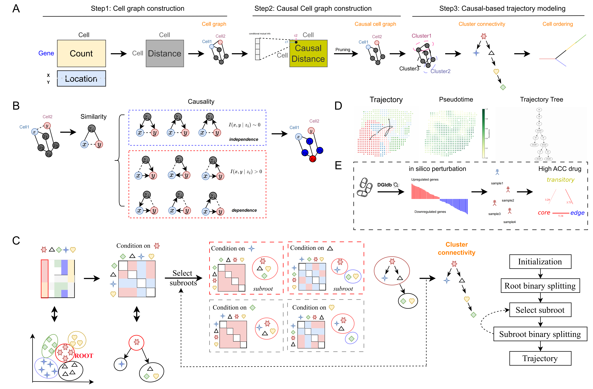

<div align="center">
   
</div>
<div>
<h1> Inferring Causal Trajectories from Spatial Transcriptomics Using CASCAT</h1>
</div>

**CASCAT** is a **tree-shaped structural causal model** with the local Markovian property between clusters and
conditional independences to infer a unique cell
differentiation trajectory, overcoming Markov equivalence in high-dimensional, non-linear data.
**CASCAT** **eliminates redundant links** between spatially close but independent cells,
creating a causal cell graph that enhances the accuracy of existing spatial clustering algorithms.


<br/>
<p align="center">
    
</p>
<br/>


## Installation & Setup

This step can be finished within a few minutes.

1. Install [Miniconda](https://docs.anaconda.com/miniconda/miniconda-install/) if not already available.
2. Create a new cascat environment, activate it, and install the basic packages.

```bash
conda create -n cascat python==3.10 -y 
conda activate cascat
```

3. Install PyTorch and PyG.
   To select the appropriate versions, you may refer to the official websites of
   [PyTorch](https://pytorch.org/get-started/previous-versions/) and
   [PyG](https://pytorch-geometric.readthedocs.io/en/latest/install/installation.html).
   The following commands are for CUDA 11.8.

```bash
pip install torch==2.1.1 torchvision==0.16.1 torchaudio==2.1.1 --index-url https://download.pytorch.org/whl/cu118
pip install torch_geometric pyg_lib torch_scatter torch_sparse torch_cluster torch_spline_conv -f https://data.pyg.org/whl/torch-2.1.0+cu118.html
pip install scanpy matplotlib networkx scikit-misc numpy pydot numba==0.57.1 PyYAML numba-scipy
```

4. (optinal) Install R to generate simulated data.

```bash
conda create -n r_env r-essentials r-base -y; 
conda activate r_env
conda install r-mclust
export R_HOME='/home/yourname/miniconda3/envs/r_env/lib/R'
export rScript = '/home/yourname/miniconda3/envs/r_env/bin/Rscript'
```

## Dataset

We provide a simulated dataset **tree1** under ./data/tree1 as an example dataset. All the ten simulated datasets used
in the paper can be accessed
from [Google drive](https://drive.google.com/drive/folders/1Ycm_e7EtX07cjuw0a5vbCs_dIswT-n7n?usp=sharing).

## 🔥 Run CASCAT

CASCAT takes a standard AnnData (adata) object as input.
The observations `obs` are cells/spots and variables `var` are genes.

### Cluster

(optinal) To access the clustering metrics, set `verbose=True` when training the graph structure learning and store true
cluster labels
in `adata.obs['cluster']`.

1. update params in `./config/tree1.yml`
    1. `CMI_dir` as the directory for storing the casual cell graph outputs.(Note: we have provided the pre-caculated
       CMI values between cells in the data folder)
    2. `percent` as the percentage of the causal cell graph to be removed, default is 0.05 in scRNA-seq dataset and 0.15
       in ST dataset.
2. To run CASCAT get **cluster** result, you can execute following code:

   `python main.py --yml_path ./config/tree1.yml --mode train --verbose True`

### Trajectory Inference

(optinal) To access the TI metrics, store the true pseudo-time labels in `adata.uns['timecourse']` and the trajectory
topology in `adata.uns['milestone_network']`.

1. update params in `./config/tree1.yml`
    1. `emb_path` is the path of clustering embedding.
    2. `job_dir` is the directory of storing the clustering output.
    3.  `output_dir` is the directory of storing the trajectory output.

2. To run CASCAT get **trajectory** result, you can execute following code:

   `python main.py --yml_path ./config/tree1.yml --mode infer`
3. To visualize the results, refer to the [Visualization.ipynb](Visualization.ipynb) notebook

### Output

The output of **CASCAT** is a new adata object, with the following information stored
within it:

- `adata.obs['cascat_clusters']` The predicted cluster labels.
- `adata.obsm['cascat_embedding']` The generated low-dimensional cell embeddings.
- `adata.uns['cascat_connectivities']` The inferred trajecory topology connectivities.
- `adata.uns['CMI']` The inferred conditional mutual information matrix for each cluster.

### Trajectory Inference Benchmarking

To reproduce the reported results in the paper, we provide all the related configs
under [Google drive](https://drive.google.com/drive/folders/1wtixZrL36yynIq90vTj1m55RPnQ6c-JA?usp=drive_link).


## 🎉 InformationMeasures

We've implemented the Python version of [InformationMeasures.jl](https://github.com/Tchanders/InformationMeasures.jl), enhanced with a kernel function accelerated by numba. 
Consult the [InfoMeasure.ipynb](InfoMeasure.ipynb) for usage details.
