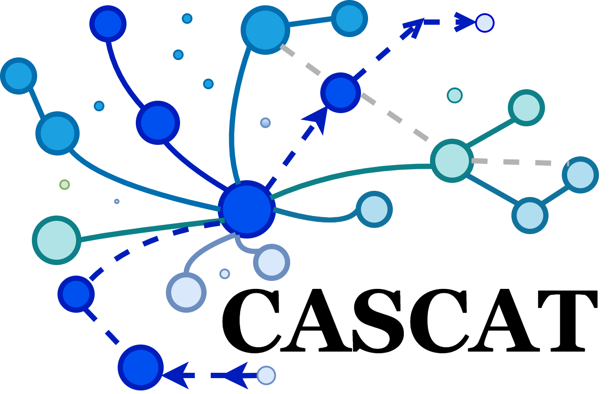
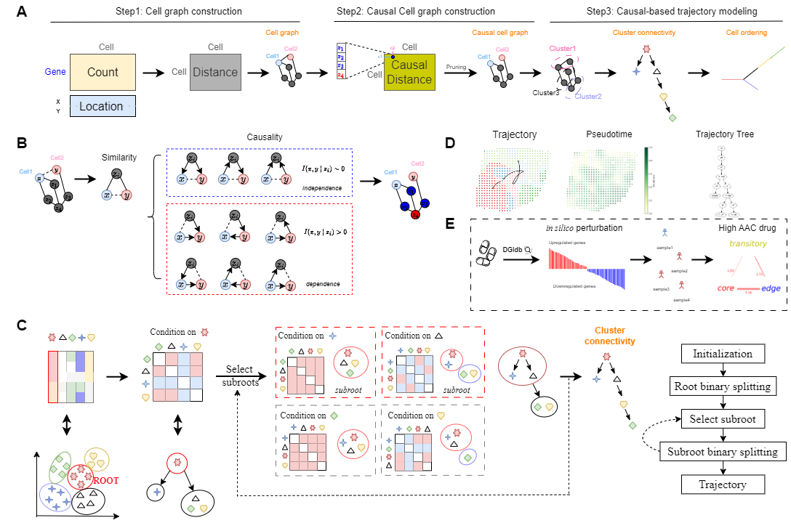

<p align="center">

</p>
<h1> <p align="center">
   Inferring Causal Trajectories from Spatial Transcriptomics Using CASCAT
</p> </h1>

[](https://github.com/deepomicslab/CASCAT)
[](https://hits.seeyoufarm.com)
[](https://github.com/deepomicslab/CASCAT)

**CASCAT** is a **tree-shaped structural causal model** with the local Markovian property between clusters and
conditional independences to infer a unique cell
differentiation trajectory, overcoming Markov equivalence in high-dimensional, non-linear data.
**CASCAT** **eliminates redundant links** between spatially close but independent cells,
creating a causal cell graph that enhances the accuracy of existing spatial clustering algorithms.


<br/>
<p align="center">
    
</p>
<br/>

## Installation & Setup

This step can be finished within a few minutes.

1. Install [Miniconda](https://docs.anaconda.com/miniconda/miniconda-install/) if not already available.
2. Create a new cascat environment, activate it, and install the basic packages.

```bash
conda create -n cascat python==3.10 -y 
conda activate cascat
```

3. Install PyTorch and PyG.
   To select the appropriate versions, you may refer to the official websites of
   [PyTorch](https://pytorch.org/get-started/previous-versions/) and
   [PyG](https://pytorch-geometric.readthedocs.io/en/latest/install/installation.html).
   The following commands are for CUDA 11.8.

```bash
pip install torch==2.1.1 torchvision==0.16.1 torchaudio==2.1.1 --index-url https://download.pytorch.org/whl/cu118
pip install torch_geometric==2.6.1 pyg_lib torch_scatter torch_sparse torch_cluster torch_spline_conv -f https://data.pyg.org/whl/torch-2.1.0+cu118.html
pip install scanpy==1.10.1 matplotlib networkx scikit-misc pydot pot numpy==1.26.4 numba==0.57.1 scikit-learn==1.5.2 
pip install cupy-cuda11x numba==0.60.0 numba-scipy==0.4.0 pandas==2.2.3 scipy==1.11.0
```

4. (optinal) Install R to generate simulated data.

```bash
conda create -n r_env r-essentials r-base -y; 
conda activate r_env
conda install r-mclust
export R_HOME='/home/yourname/miniconda3/envs/r_env/lib/R'
export rScript = '/home/yourname/miniconda3/envs/r_env/bin/Rscript'
```

## Dataset

We provide example dataset **tree1** in the ./data/tree1/. Other simulation data is temporarily hosted
on [Google drive](https://drive.google.com/drive/folders/1Ycm_e7EtX07cjuw0a5vbCs_dIswT-n7n?usp=sharing).
Once the manuscript status is updated, it will be uploaded to Zenodo.

## 📚 Quick Start

`python main.py --YAML ./config/tree1.yml --mode train --verbose True`

The output of **CASCAT** is a new Anndata object `data_processed.h5ad` under ./result, with the following information stored
within it:

- `adata.obs['cascat_clusters']` The predicted cluster labels.
- `adata.obsm['cascat_embedding']` The generated low-dimensional cell embeddings.
- `adata.uns['cascat_connectivities']` The inferred trajecory topology connectivities.
- `adata.uns['CMI']` The inferred conditional mutual information matrix for each cluster.


## 📈 Benchmarking

The YAML files for all datasets are stored on [Google Drive](https://drive.google.com/drive/folders/1EMyU0E1VZu-6apsO_3Xe9wJxpjkAGWJa), and the **comparison method** scripts are located in the `submodules` folder.

## 🔥 Run CASCAT

To run CASCAT, follow the steps below:

### Step1: Data Preparation

CASCAT takes AnnData formatted input, stored in .h5ad files, where obs contains `cell/spot` information and `var` holds
gene annotations.

To use the data, place it in a folder, then update the `adata_file` field in the `tree1.yml` configuration to reflect
the relative path to the data.

### Step2: Cluster

1. update params in `./config/tree1.yml`
    1. `CMI_dir` as the directory for storing the casual cell graph outputs.
        1. We have accelerated the computation process using GPUs, completing the analysis of 2000 cells within 3
           minutes.
        2. We have provided the pre-caculated CMI values between cells in the [Google Drive](https://drive.google.com/drive/folders/10scgzqUak4tBs6Vkn20OkrV487L2DtR9).
    2. `percent` as the percentage of the causal cell graph to be removed.
        1. default is **0.1** in scRNA-seq dataset and **0.15** in ST dataset.
2. To run CASCAT get **cluster** result, you can execute following code:

   `python main.py --YAML ./config/tree1.yml --mode train --verbose True`
    - **Note:** To access the clustering metrics, set `verbose=True` and store ground-truth cluster labels
      in `adata.obs['cluster']`.

### Step3: Trajectory Inference

1. update params in `./config/tree1.yml`
    1. `emb_path` is the path of clustering embedding.
    2. `job_dir` is the directory of storing the clustering output.
    3. `output_dir` is the directory of storing the trajectory output.

2. To run CASCAT get only **trajectory** result, you can execute following code:

   `python main.py --YAML ./config/tree1.yml --mode infer`

    - **Note:** To access the TI metrics, store the true pseudo-time labels in `adata.uns['timecourse']` and the trajectory
      topology in `adata.uns['milestone_network']`.
### Step4: Visualization
To visualize the results, refer to the [Visualization.ipynb](reproduce.ipynb) notebook


## 🎉 InformationMeasures

We've implemented the Python version of [InformationMeasures.jl](https://github.com/Tchanders/InformationMeasures.jl),
enhanced with a kernel function.

Consult the [InfoMeasure.ipynb](InfoMeasure.ipynb) for usage details.

In addition, we also provide a GPU version implemented with [CuPy](https://cupy.dev/), as well as a parallel version implemented with Numba to accelerate the computation of conditional mutual information.

